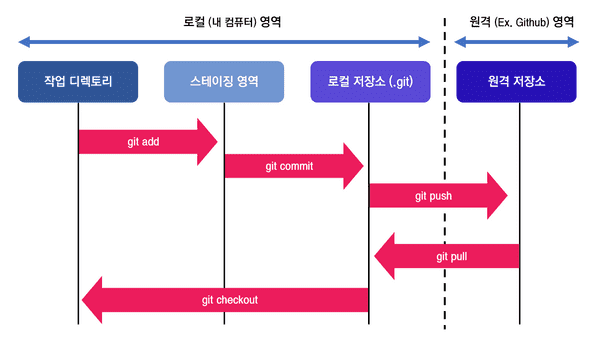

## Mark Down 학습

## 제목(heading)

    제목은 #으로 표현

### 목록
- 사과
- 배
- 바나나
    - 씨앗
    - 없음
1. 구글
2. 네이버
    1. 웹툰
    2. 뉴스

### 코드

```python
a=100
print(*)
```

```sql
-- 주석
SELECT * FROM hp;
```

### 하이퍼링크

[devrel](https://d2.naver.com/news/3435170)<br>
[마크다운가이드](https://www.markdownguide.org/)<br>
[작성기술](https://developers.google.com/tech-writing)


### 테이블

|이름|나이|성별|
|:--|--:|:--:|
|홍태광|28|남|

### 텍스트

*텍스트* **텍스ㅡㅌ** ~~텍스트~~

### 인용
>용인

---
---
---
### 메모
[^1]: 메모메모메모메모메모메모
[^bignote]: 메모메모메모메모메모메모메모메모메모메모메모메모메모메모메모메모메모메모메모메모


### 체크박스 //??
- [x] 했다
- [ ] Update the website
- [ ] Contact the media

 :warning: **Warning:** Do not push the big red button.

:memo: **Note:** Sunrises are beautiful.

:bulb: **Tip:** Remember to appreciate the little things in life.

---
---
---


# GIT 사용법

1. `git init`으로 새로운 GIT 저장소 초기화
2. `git add <file>` 또는 `git add .`로 스테이징 영역에 추가
3. `git commit -m "commit message"`스테이징된 변경사항을 커밋


>`git status` 디렉토리의 상태 확인<br>
>`git log` 커밋 기록 확인

# GitHub PUSH

1. 깃허브 repository 생성
2. `git remote add origin '리포지토리 주소.git'`  원격 리포지토리 연결
3.  `git push origin '브랜치 이름'`로 PUSH
