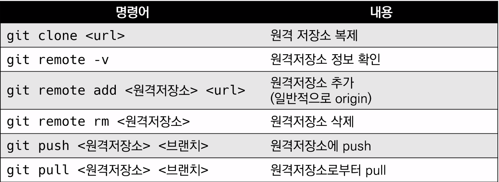
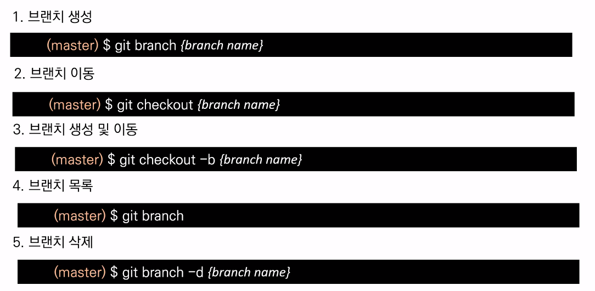
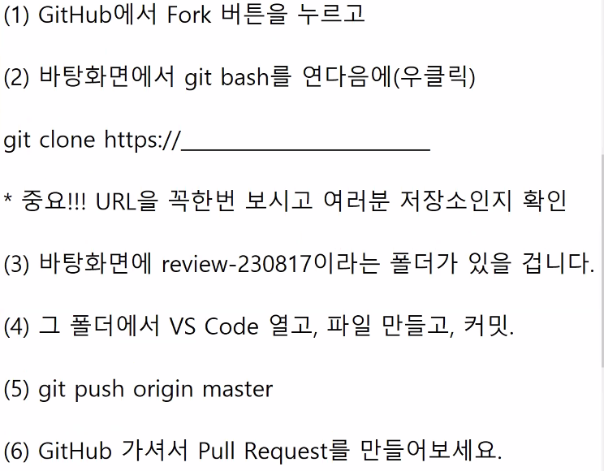
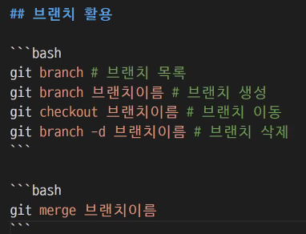

# Git/GitHub 활용 실습

## 프로젝트 - 프로필

1. 프로젝트 시작
    - 바탕화면에 폴더
    - README.md 파일이 반드시 필요
    - git 저장소로 만들고 커밋

2. GitHub
    - 원격저장소 이름은 반드시 **`username`으로**
    - 원격저장소 설정을 마무리하고 push하면 끝!

3. 프로필 확인 : https://github.com/username

4. 실습 완료 후 체크시트에 링크 업데이트

5. 구글에 GitHub Profile Readme라고 검색하면서 다양하게 꾸미고, 설정할 수 있는 방법이 많음

## clone
1. REPO에 CODE의 주소 복사
2. bash에서 `git clone <주소>`


## 깃에 파일 예외
1. .gitignore 파일을 만듦
2. 파일 안에 제외하고 싶은 파일을 확장자명까지 작성
>[깃 이그노어](https://gitignore.io)
>에서 검색해 전체 파일을 복붙해 씀

##### 검색 예시
- 개발언어 : python, java
- 개발환경 : windows, mac

##### 파일 작성 예시 
- 특정파일 : a.txt(모든 a.txt), test/a.txt(테스트 폴더의 a.txt)
- 특정 디렉토리 : /my_scecret
- 특정 확장자 : *.exe
- 예외 처리 : !b.exe


# branch

#### 명령어

- 강사님 코드<br>
    git checkout main   <br>
    git merge login     <br>
    git log --oneline   <br>
    git branch board    <br>
    git checkout board  <br>
    git add .           <br>
    git commit -m '게시판 기본 구조 작성'   <br>
    묶기                <br>
    git checkout main   <br>
    git merge board     <br>
> 충돌이 많을 경우 확인 명령어
> `git status`
---
### 1. 브랜치 생성
예를 들어, `feature-x`라는 이름의 브랜치를 생성하려면 다음과 같이 입력
```bash
- git branch feature-x
```
### 2. 브랜치 선택(체크아웃)

브랜치를 선택하려면 git checkout 명령을 사용.<br>
`feature-x`브랜치로 전환하려면 다음과 같이 입력
```bash
git checkout feature-x
```

### 3. 브랜치 생성 및 선택을 동시에 하기

새로운 브랜치를 생성하면서 동시에 그 브랜치로 전환하려면 -b 옵션을 사용하여 git checkout 명령을 실행
```bash
git checkout -b feature-x
```

### 4. 현재 선택된 브랜치 확인

현재 어떤 브랜치가 선택되어 있는지 확인하려면 git branch 명령만 실행
```bash
git branch
```

##### conflict가 있을 경우 

1. `git add` 
2. `git commit`
>pull request

## 정리 GitHub로 협업을 한다는 것은


1. 작업하기 전에 브랜치를 만든다.
git branch 브랜치 이름
git checkout 브랜치 이름

2. 열심히 코딩한다.

3. 버전을 기록한다.
git add . / fit commit -m

4. 작업이 끝나며느 작업한 브랜치를 push 한다.
Git push origin 브랜치 이름

5. GitHub에서 Pull Request를 생성한다.

6. 코드 리뷰 등 협업 룰에 따라서 진행하고 다 완료되면 merge 가 GitHub에서 된다.

## fork
1. fork             
2.     

3.    

4.     내 저장소에 push완료

5.     fork가 원본프로젝트에 pk됨

정리



## 병합의 종류

1. **Fast-forward 병합**
   - 변경 사항이 선형적일 때 사용됩니다.
   - 브랜치 포인터만 앞으로 이동하며 별도의 병합 커밋을 만들지 않습니다.

2. **3-way 병합**
   - 두 브랜치 모두에서 변경이 발생했을 때 사용됩니다.
   - 병합 커밋이 생성되며, 이 커밋은 두 부모 커밋을 가집니다.

## 병합 커밋

- 두 개의 부모를 가진 특별한 커밋입니다.
- 병합 중 **충돌**이 발생하면, 해당 충돌을 수동으로 해결한 후 병합 커밋을 만들어야 합니다.
- `git log`에서 그래프 옵션을 사용하여 확인 가능합니다.

## 예시

1. A branch와 B branch에서 각각 작업을 진행하였다고 가정합니다.
2. `main` 브랜치에서 `git merge A` 명령을 실행하면 A branch의 변경 사항이 `main`에 병합됩니다.
3. 이후 `main`에서 `git merge B` 명령을 실행하면 B branch의 변경 사항이 `main`에 병합됩니다. 만약 A branch와 B branch에서 같은 파일의 같은 부분을 수정했다면 여기서 충돌이 발생합니다.

Git의 히스토리 관리와 병합 기능은 코드의 여러 버전을 효과적으로 관리하고 팀원들과 협업할 때 매우 유용합니다.

---
---
---
# 강사님 정리

원격 저장소 활용
### push
```bash
git push origin main
```
### pull
```bash
git pull origin main
```
- `origin `: 원격 저장소의 이름
- `main`: 브랜치의 이름


## 기타 명령어
### git add를 취소
1. 1개 파일삭제 <br>
예를 들어, 파일명이 example.txt인 경우
```bash
git reset HEAD example.txt
```
2. 모든 파일 삭제
```bash
git reset HEAD
```
### 커밋 메시지를 변경
1. 최신 커밋 메시지 변경
```bash
git commit --amend

```
> COMMIT MESSAGE가 바뀌면 #해쉬값이 바뀜

2. 이전 커밋 메시지 변경:
만약 최신 커밋 이전의 커밋 메시지를 변경하고 싶다면 git rebase -i HEAD~n 명령을 사용하여 인터랙티브 리베이스를 실행합니다. 여기서 n은 변경하려는 커밋 개수임
```bash
git rebase -i HEAD~3

```
### 커밋을 취소
1. 마지막 커밋 취소 및 변경 내용 보존
```bash
git reset HEAD~
```
>위 명령을 사용하면 최근 커밋을 취소하고 해당 커밋에 포함된 변경 내용은 스테이징 영역에 되돌립니다. 변경 내용은 작업 디렉토리에 남아 있습니다. 이후에 변경 내용을 수정하고 새로운 커밋을 생성할 수 있습니다.
2. 마지막 커밋 취소 및 변경 내용 삭제
```bash
git reset --hard HEAD~
```
>위 명령을 사용하면 최근 커밋을 취소하고 해당 커밋에 포함된 변경 내용도 삭제합니다. 이 작업은 되돌릴 수 없는 변경 내용을 삭제하므로 주의해야 합니다.
3. 이전 커밋 취소:
```bash
git reset HEAD~2
```
>위 명령은 두 개 이전의 커밋을 취소하고 해당 커밋에 포함된 변경 내용은 스테이징 영역으로 되돌립니다.